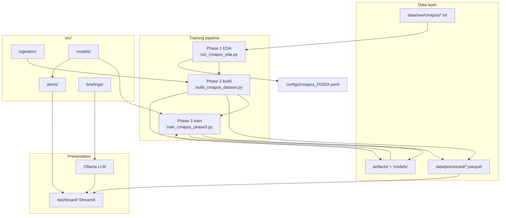
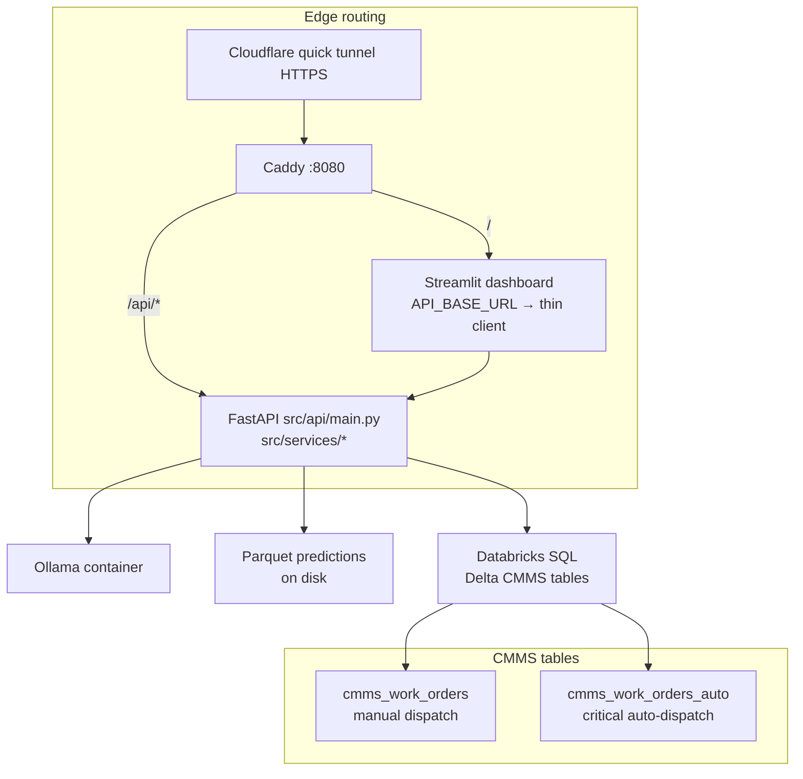
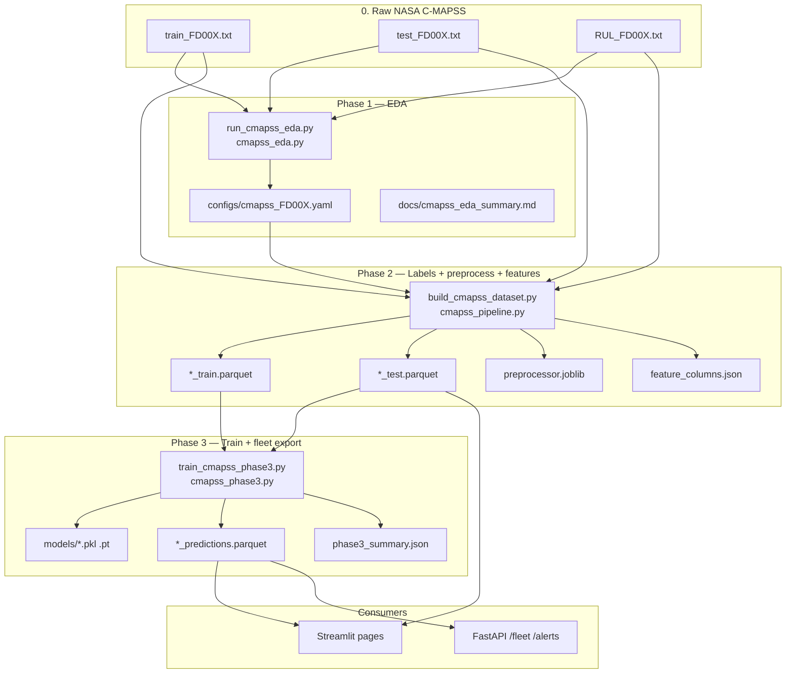
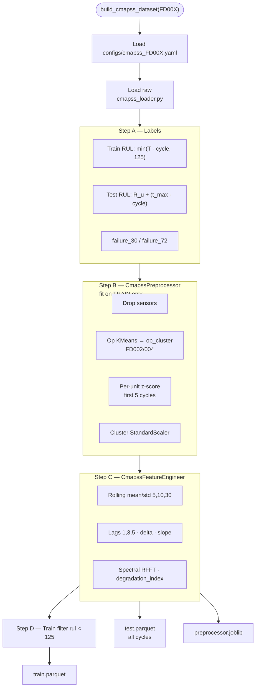
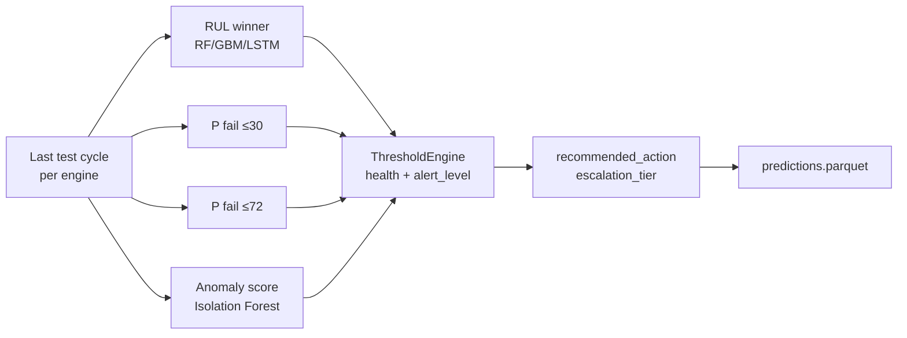

# Architecture — Industrial Predictive Maintenance System

Predict equipment failures and remaining useful life (RUL) from sensor telemetry, score fleet health, route CMMS work orders, and deliver operator briefings via Streamlit and FastAPI.

**Deep dive (raw → Parquet):** [docs/cmapss_data_pipeline_diagram.md](docs/cmapss_data_pipeline_diagram.md)

---

## 1. Full system architecture

### Local / offline (train + dashboard)

### Deployment (interview / tunnel)

Runbook: [docs/uc5_demo_runbook.md](docs/uc5_demo_runbook.md) · Design: [docs/deployment.md](docs/deployment.md)

| Layer | Role |
|-------|------|
| `dashboard/` | UI; uses `api_client` when `API_BASE_URL` is set |
| `src/api/` | REST: fleet, assets, alerts, briefings, metrics, CMMS |
| `src/services/` | Business logic, alert ack store, auto-dispatch orchestration |
| `src/alerts/cmms_databricks.py` | SQL writes to manual + auto Delta tables |
| `docker-compose.yml` | ollama, api, dashboard, caddy proxy |

Training stays offline; deployment **serves** precomputed Phase 3 `predictions.parquet`. Re-export: `scripts/export_fleet_predictions.py`.

---

## 2. Data pipeline (C-MAPSS)

### Master flow — raw files to all Parquet outputs

### Phase 2 — inside `build_cmapss_dataset()`

### Parquet roles

| File | Rows | Used for |
|------|------|----------|
| `cmapss_*_train.parquet` | Degrading train cycles (RUL &lt; 125) | Phase 3 fit |
| `cmapss_*_test.parquet` | All test cycles | Trajectory charts; last-cycle scoring |
| `cmapss_*_predictions.parquet` | One row per engine | Fleet, alerts, API `/fleet` |

`preprocessor.joblib` stores fitted normalization (KMeans, baselines, scalers) for replay; Phase 3 reads Parquet directly.

---

## 3. Inference, alerts, and CMMS

**Health score (0–100):** `0.6 × (RUL/125) + 0.4 × (1 − P_fail30)`, capped. Alert level uses separate rules on RUL, failure probability, and anomaly score.

**CMMS routing** (`src/alerts/cmms_routing.py`):

| Priority | SLA | Typical trigger |
|----------|-----|-----------------|
| P1 | 4 h | Critical alert |
| P2 | 72 h | Warning |
| P3 | 168 h | Monitor |

- **Manual dispatch** → `cmms_work_orders` (operator button)
- **Auto-dispatch** → `cmms_work_orders_auto` when `CMMS_AUTO_DISPATCH=true` and alert is critical

---

## 4. API surface (FastAPI)

| Method | Path | Purpose |
|--------|------|---------|
| GET | `/health` | Liveness |
| GET | `/fleet`, `/assets/{id}` | Fleet + asset detail |
| GET | `/alerts` | Active alerts |
| POST | `/alerts/ack` | Acknowledge alert (in-memory demo) |
| GET | `/metrics/phase3`, `/metrics/registry` | Model metrics |
| POST | `/briefings` | Asset AI/instant briefing |
| POST | `/briefings/shift` | Shift handover briefing |
| POST | `/metrics/explain` | Ollama metrics narrative |
| POST | `/cmms/workorders` | Manual work order |
| POST | `/cmms/auto-dispatch` | Critical auto-dispatch |
| GET | `/cmms/workorders/recent`, `.../auto` | Recent orders |

---

## 5. Module responsibilities

| Module | Purpose |
|--------|---------|
| `src/ingestion/` | `cmapss_loader`, EDA, `CmapssPreprocessor`, `CmapssFeatureEngineer`, `cmapss_pipeline` |
| `src/models/` | RUL, failure classifiers, LSTM, anomaly, survival, `cmapss_phase3`, MLflow |
| `src/alerts/` | `ThresholdEngine`, payloads, mock CMMS, Databricks, routing |
| `src/briefings/` | Ollama client, asset/shift/metrics prompts |
| `src/services/` | Fleet, alerts, briefings, auto-dispatch, paths |
| `src/api/` | FastAPI app and Pydantic schemas |
| `src/utils/` | NASA PHM score, charts |
| `dashboard/` | Streamlit pages + `api_client` |
| `scripts/` | Download, EDA, build, train, export, deploy |

---

## 6. Models

| Component | Task | Algorithm | Output |
|-----------|------|-----------|--------|
| `rul_regressor.py` | RUL | RF / GBM | Cycles remaining |
| `lstm_model.py` | Sequence RUL | PyTorch LSTM | Cycles remaining |
| `failure_classifier.py` | Failure horizon | GBM | P(fail @30 / @72) |
| `anomaly_detector.py` | Unsupervised drift | Isolation Forest | anomaly_score 0–100 |
| `survival_model.py` | Time-to-failure | Cox PH (optional) | Survival / RUL Cox |

Phase 3 picks the **lowest NASA score** RUL model on validation; failure and anomaly models are always trained.

---

## 7. Alert thresholds (.env)

| Variable | Default | Meaning |
|----------|---------|---------|
| `ALERT_RUL_CRITICAL` | 10 | Critical RUL cutoff |
| `ALERT_RUL_WARNING` | 30 | Warning RUL cutoff |
| `ALERT_FAILURE_PROB_CRITICAL` | 0.85 | Critical failure probability |
| `ALERT_FAILURE_PROB_WARNING` | 0.60 | Warning failure probability |
| `CMMS_AUTO_DISPATCH` | false | Auto-write critical alerts to Delta |
| `CMMS_AUTO_DELTA_TABLE` | — | Target table for auto-dispatch |

---

## 8. Technology stack

- **Python 3.10+** · **pandas / Parquet** · **scikit-learn** · **PyTorch** · **lifelines** (optional)
- **MLflow** · **Streamlit** · **Plotly** · **FastAPI** · **Ollama**
- **Docker Compose** · **Caddy** · **Cloudflare tunnel** · **Databricks SQL** (deployment CMMS)

---

## 9. Deployment notes

- Raw data and `mlruns/` are gitignored; download and train locally before demo.
- `models/` and `data/processed/` are generated by the pipeline.
- CMMS mock logs when Databricks is unreachable; deployment uses real Delta when configured.
- Ollama runs in Docker on `deployment`; local dev may use host Ollama.
- Dashboard auto-dispatch uses two-phase load + SQL timeout to avoid UI hangs.

---

## 10. Editable diagrams

- **draw.io:** `architecture/system_diagram.drawio`
- **Mermaid (full pipeline):** [docs/cmapss_data_pipeline_diagram.md](docs/cmapss_data_pipeline_diagram.md)
