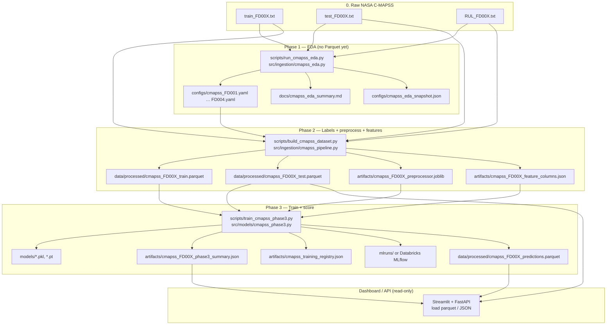
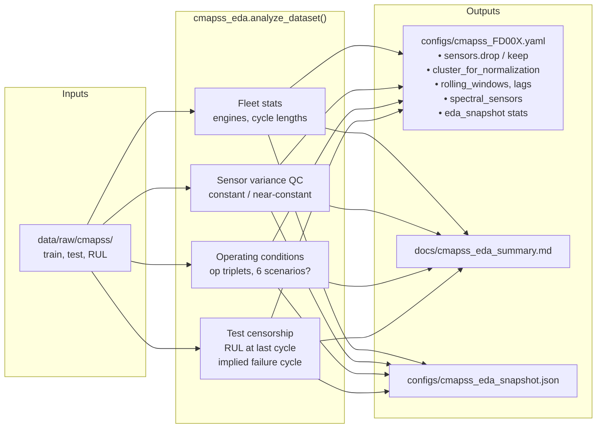
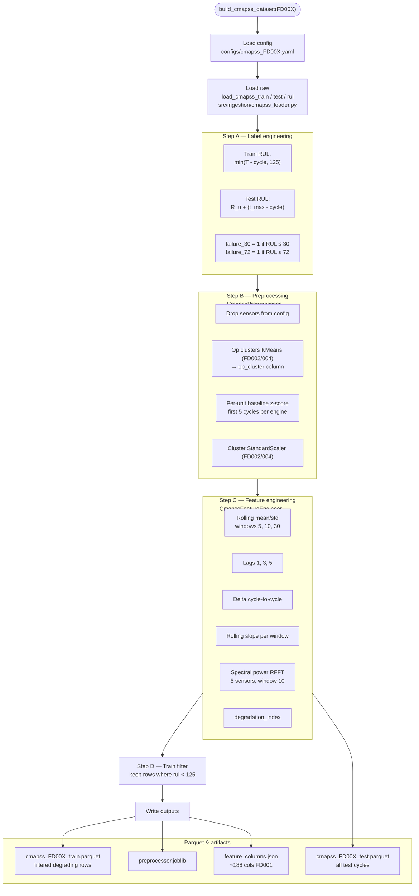
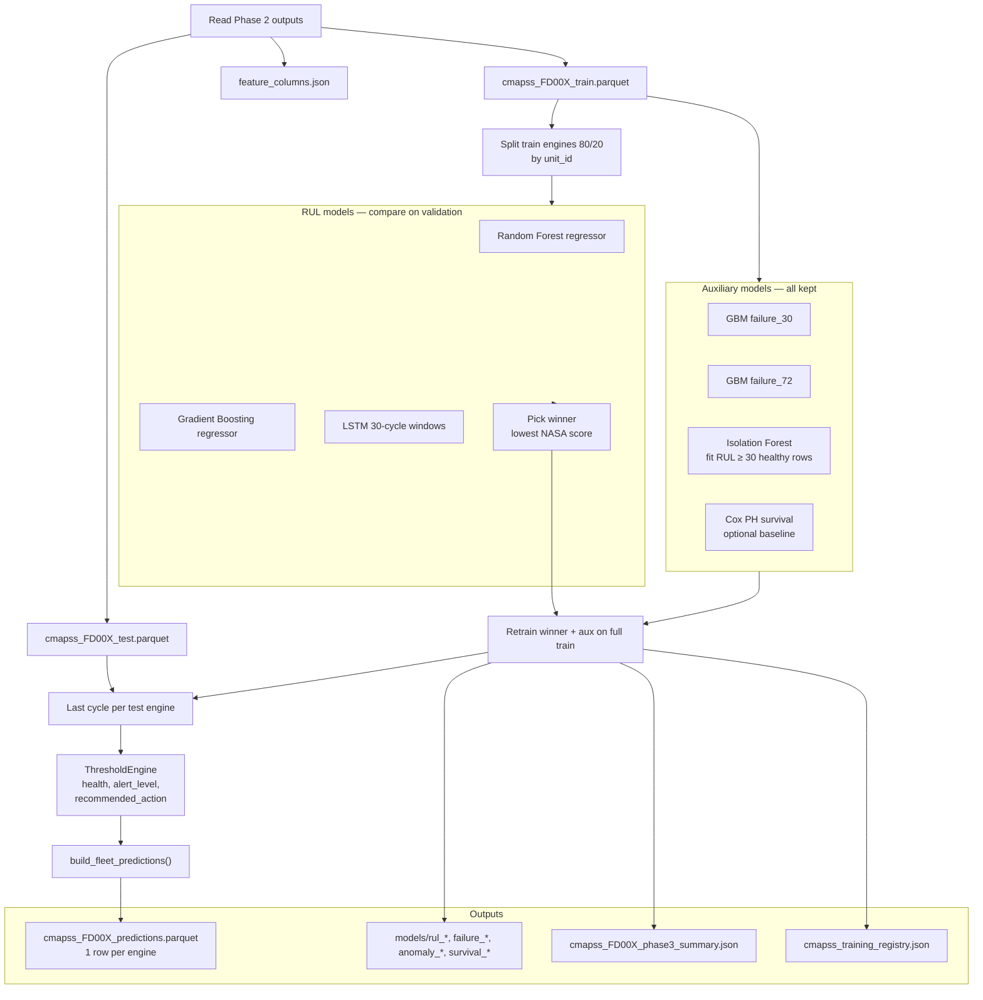
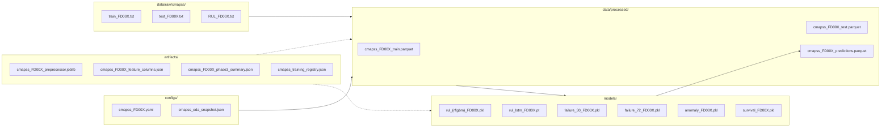
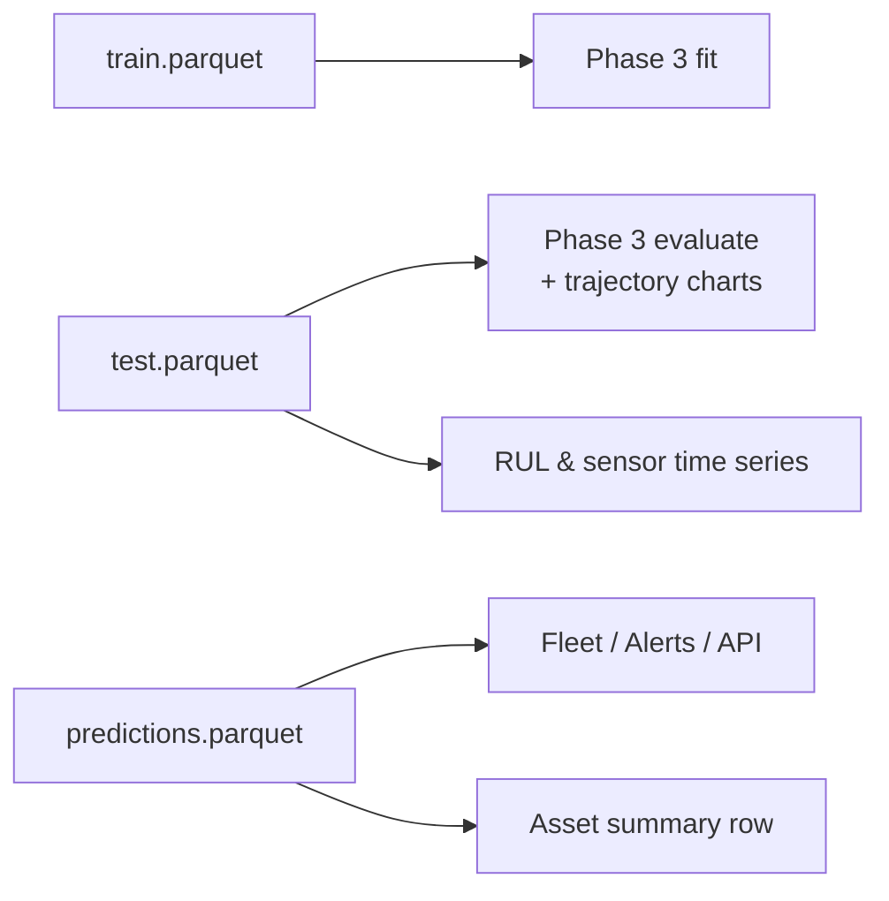

# CMAPSS data pipeline — raw files to Parquet (complete diagram)

End-to-end path from NASA `.txt` files through EDA, labels, preprocessing, feature engineering, training, and fleet Parquet used by the dashboard.

**Commands (in order):**

```bash
python scripts/download_cmapss_data.py          # optional
python scripts/run_cmapss_eda.py                # Phase 1
python scripts/build_cmapss_dataset.py --all    # Phase 2
python scripts/train_cmapss_phase3.py --all     # Phase 3 (+ predictions parquet)
```

---

## Master flow (all phases → all Parquet outputs)



---

## Phase 1 — EDA detail (feeds YAML, not Parquet)



| EDA decision | Example FD001 | Used in Phase 2 |
|--------------|---------------|-----------------|
| Drop constant sensors | 7 sensors dropped | `CmapssPreprocessor` |
| Keep sensors | 14 kept | Feature columns |
| Op clustering | `false` (1 condition) | Skip KMeans |
| Op clustering | `true` (FD002/004) | KMeans + cluster scaler |
| Spectral sensors | First 5 kept sensors | `CmapssFeatureEngineer` |
| Train filter RUL | `< 125` | Last step Phase 2 |

---

## Phase 2 — Inside `build_cmapss_dataset()` (train/test Parquet)



### Columns in Phase 2 Parquet (conceptual)

| Column group | Examples | Role |
|--------------|----------|------|
| Keys | `unit_id`, `cycle` | Engine + time |
| Labels | `rul`, `failure_30`, `failure_72` | Train targets |
| Ops | `op_setting_1..3`, `op_cluster` | Regime context |
| Engineered | `sensor_2_roll5_mean`, `sensor_3_delta1`, … | Model inputs |
| Scalar | `degradation_index` | Health proxy feature |
| Raw sensors | Still in frame internally | Excluded from `feature_columns.json` list |

**Note:** Test parquet is **not** RUL-filtered (all censored trajectories kept for charts + last-cycle scoring).

---

## Phase 3 — Models → predictions Parquet



### `predictions.parquet` — one row per engine (dashboard source)

| Column | Source model / logic |
|--------|-------------------|
| `asset_id`, `unit_id`, `cycle` | Last test row |
| `rul_true` | Label at last cycle |
| `rul_pred` | **RUL winner** (RF/GBM/LSTM) |
| `failure_prob_30`, `failure_prob_72` | Failure GBM classifiers |
| `rul_pred_cox`, `survival_prob_30/72` | Cox (if trained) |
| `anomaly_score`, `is_anomaly` | Isolation Forest |
| `health_score`, `risk_score` | ThresholdEngine formula |
| `alert_level`, `alert_message` | ThresholdEngine rules |
| `recommended_action`, `escalation_tier` | Rules + CMMS routing |
| `sensor_readings_json` | Snapshot at last cycle |
| `rul_model` | Winner name (`gbm`, `rf`, `lstm`) |

**File path:** `data/processed/cmapss_{FD001|FD002|FD003|FD004}_predictions.parquet`

---

## Complete file inventory (by folder)



---

## Swimlane: who reads which Parquet

| Parquet | Rows | Primary consumer |
|---------|------|------------------|
| `*_train.parquet` | Many (degrading) | Phase 3 training only |
| `*_test.parquet` | Many (all cycles) | Phase 3 test metrics; Asset Detail **trajectory charts** |
| `*_predictions.parquet` | One per engine | Fleet Overview, Active Alerts, Asset Detail **summary**, API `/fleet` |



---

## Code map (quick reference)

| Step | Script | Core module |
|------|--------|-------------|
| Download | `scripts/download_cmapss_data.py` | `src/ingestion/cmapss_download.py` |
| Phase 1 EDA | `scripts/run_cmapss_eda.py` | `src/ingestion/cmapss_eda.py` |
| Phase 2 build | `scripts/build_cmapss_dataset.py` | `src/ingestion/cmapss_pipeline.py` |
| Load/labels | — | `src/ingestion/cmapss_loader.py` |
| Preprocess | — | `src/ingestion/cmapss_preprocessor.py` |
| Features | — | `src/ingestion/feature_engineer.py` |
| Phase 3 | `scripts/train_cmapss_phase3.py` | `src/models/cmapss_phase3.py` |
| Re-export fleet | `scripts/export_fleet_predictions.py` | loads saved models + test parquet |
| Dashboard load | — | `dashboard/data_loader.py` |
| API load | — | `src/services/fleet_service.py` |

---

## Related docs

- [cmapss_eda_summary.md](cmapss_eda_summary.md) — Phase 1 findings  
- [cmapss_phase2_preprocessing.md](cmapss_phase2_preprocessing.md) — Phase 2 methodology  
- [cmapss_phase3_modeling.md](cmapss_phase3_modeling.md) — Phase 3 metrics & winner  
- [datasets/cmapss.md](datasets/cmapss.md) — NASA dataset overview  
