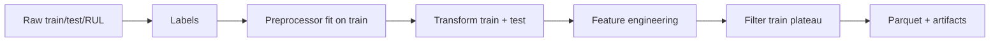

# CMAPSS Phase 2 — Labels, Preprocessing & Feature Engineering

Phase 2 turns raw NASA C-MAPSS files into **model-ready Parquet datasets** with leakage-safe preprocessing, UC5-aligned labels, and extended health indicators. It implements the plan from [cmapss_eda_summary.md](cmapss_eda_summary.md) §7.

**Prerequisite:** Phase 1 complete (`configs/cmapss_FD00X.yaml`).

---

## 1. What Phase 2 delivers

| Output | Path | Purpose |
|--------|------|---------|
| Training features | `data/processed/cmapss_{FD00X}_train.parquet` | RUL + failure models (degrading rows) |
| Test features | `data/processed/cmapss_{FD00X}_test.parquet` | Benchmark evaluation |
| Fitted preprocessor | `artifacts/cmapss_{FD00X}_preprocessor.joblib` | Replay normalization at inference |
| Feature manifest | `artifacts/cmapss_{FD00X}_feature_columns.json` | Column list for training |

**Run:**

```bash
python scripts/build_cmapss_dataset.py --dataset FD001
python scripts/build_cmapss_dataset.py --all   # FD001–FD004
```

---

## 2. Pipeline overview



**Code entry point:** `src/ingestion/cmapss_pipeline.py` → `build_cmapss_dataset()`

---

## 3. Step-by-step methodology

### Step 1 — Load raw data

Uses `cmapss_loader.py` and paths from `configs/cmapss_{FD00X}.yaml`.

### Step 2 — Label engineering

#### Training RUL (piecewise capped)

For each engine, at cycle `t` with final cycle `T`:

```text
RUL_train(t) = min(T - t, cap)     # cap = 125 (config)
```

**Why:** Standard NASA PHM benchmark; stops the model from learning only “healthy” late-plateau cycles as infinitely far from failure.

#### Test RUL (reconstructed from NASA file)

`RUL_FD00X.txt` gives **remaining cycles only at the last observed test cycle** per engine.

For unit `u` with last cycle `t_max` and label `R_u`:

```text
RUL_test(t) = R_u + (t_max - t)
```

Implemented in `compute_test_rul()`. At `t = t_max`, this equals `R_u` (validated in unit tests).

**Why:** Every test row needs a label for sequence models; the competition scores **last-cycle** predictions per engine.

#### Failure-within-horizon (UC5 secondary targets)

From RUL:

```text
failure_30 = 1  if RUL ≤ 30
failure_72 = 1  if RUL ≤ 72
```

**Why:** UC5 asks for failure probability in 24/72 **hours**; CMAPSS uses **cycles**. We document 1 cycle ≈ 1 operating interval and use 30/72 cycles as planning horizons (see presentation assumptions).

### Step 3 — Sensor selection

Drop sensors listed in config (`sensors.drop` from Phase 1 EDA). FD001 drops 7 constant/low-variance sensors; FD002/004 keep all 21.

### Step 4 — Leakage-safe preprocessing (`CmapssPreprocessor`)

| Action | Fit on | Apply to | Leakage safe? |
|--------|--------|----------|----------------|
| Drop sensors | Config | Train + test | Yes |
| Op-cluster KMeans (6) | Train only | Train + test | Yes |
| Per-unit baseline norm | Each unit’s early cycles | Same unit | Yes |
| Cluster StandardScaler | Train per cluster | Train + test | Yes |

#### Per-unit baseline normalization

For each engine, use the **first 5 cycles** to compute per-sensor mean/std, then z-score that engine’s sensor readings.

**Why:** Removes unit-to-unit manufacturing spread; each engine compared to its own healthy baseline. Test engines use **their own** early cycles (not train statistics).

#### Operating-condition clustering (FD002, FD004)

When `cluster_for_normalization: true`:

1. `KMeans(n=6)` on rounded `(op_setting_1..3)` — **fit on train only**.
2. `StandardScaler` per cluster on kept sensors — **fit on train only**.
3. Assign cluster to test rows via the same KMeans.

**Why:** Phase 1 flagged 6 NASA scenarios; naive global scaling mixes flight regimes.

### Step 5 — Feature engineering (`CmapssFeatureEngineer`)

Config-driven extensions beyond Phase 1 rolling/lag:

| Feature family | Description | UC5 mapping |
|----------------|-------------|-------------|
| Rolling mean/std | Windows 5, 10, 30 | Rolling statistics |
| Lags 1, 3, 5 | Historical sensor values | Temporal context |
| Delta (`_delta1`) | Cycle-to-cycle change | Rate-of-change |
| Rolling slope | Linear trend per window | Degradation velocity |
| Spectral power | RFFT energy on detrended window (top 5 sensors) | FFT-style health (adapted for non-vibration CMAPSS) |
| Degradation index | Per-unit mean abs z-score across sensors | Scalar health proxy |

Raw sensors are **not** included in `feature_columns.json` — models use engineered columns + `op_cluster` only.

### Step 6 — Training row filter

```text
Keep train rows where RUL < cap (125)
```

Rows with `RUL == 125` are the **healthy plateau** (capped); removing them focuses training on degrading behavior (standard practice).

Test set is **not** filtered (all censored trajectories kept for evaluation).

---

## 4. FD001 results (local build)

| Metric | Value |
|--------|-------|
| Train rows (after filter) | 12,500 (from 20,631) |
| Test rows | 13,096 |
| Model feature columns | 188 |
| Sensors dropped | 7 |
| Op clustering | No |

Re-run `build_cmapss_dataset.py` after code changes to refresh counts.

---

## 5. Decisions (Phase 2)

| ID | Decision | Rationale |
|----|----------|-----------|
| P2-1 | Reconstruct full test RUL curves | Required for row-level training and consistent labels |
| P2-2 | Per-unit baseline (5 cycles) | CMAPSS best practice; no cross-engine leakage |
| P2-3 | Cluster scaling only for FD002/004 | Phase 1 `cluster_for_normalization` flag |
| P2-4 | Train filter `rul < cap` | Drop healthy plateau rows |
| P2-5 | Spectral features on 5 sensors | UC5 FFT requirement, adapted for turbofan sensors |
| P2-6 | Persist preprocessor + column manifest | Reproducible inference and MLflow runs |

---

## 6. How training uses Phase 2 outputs

`python -m src.models.train` now calls `build_cmapss_dataset("FD001")` and trains:

- **RUL regressor** on `cmapss_FD001_train.parquet`
- **Failure classifier** (`failure_30`) on the same features

Next (Phase 3): evaluate on `cmapss_FD001_test.parquet` last cycle per unit with NASA score.

---

## 7. UC5 alignment

| UC5 Component A | Phase 2 |
|-----------------|---------|
| Rolling statistics | Yes |
| Rate-of-change | `_delta1` features |
| FFT / spectral | `_spectral10_power` on sensor windows |
| RUL target | `rul` column |
| Failure window | `failure_30`, `failure_72` |
| Justified preprocessing | This document + configs |

---

## 8. References

- [Phase 1 EDA](cmapss_eda_summary.md)
- [Dataset overview](datasets/cmapss.md)
- `src/ingestion/cmapss_pipeline.py`, `cmapss_preprocessor.py`, `feature_engineer.py`
