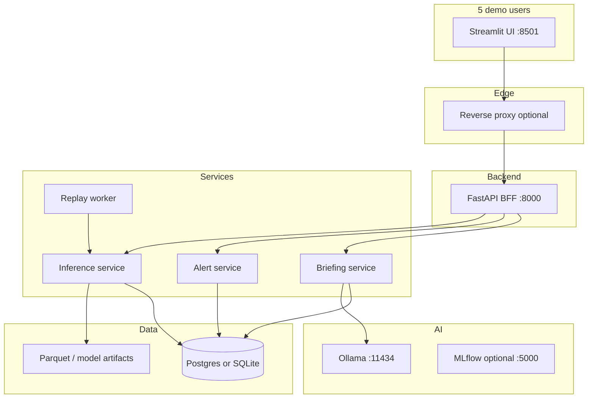

# Deployment Plan — 5-Person Live Demo

This document is the **implementation checklist** for turning the current research prototype into a **deployment-shaped** system suitable for a **live demo with ~5 concurrent users**. The **local Streamlit + Parquet + Ollama demo** on `main` / `cursor/ollama-briefing-startup-preload` remains unchanged; all work below happens on branch **`cursor/deployment-api-platform`**.

---

## Goals

| Goal | Success criteria |
|------|------------------|
| **Stable demo** | 5 people can use the UI at once without crashes or duplicate Ollama loads |
| **“Real-time” feel** | Fleet health and alerts update every N seconds (replay or ingest) |
| **Clear architecture** | Streamlit → API → services → DB/models (panel-ready diagram + OpenAPI) |
| **UC5 coverage** | Ingestion, ML, alerts, briefings, dashboard — each with an API contract |
| **Recoverable** | One-command startup, documented fallback (instant briefings only, cached fleet) |

---

## What exists today (baseline)

- [x] CMAPSS Phase 2/3 pipeline, models, MLflow logging
- [x] Fleet predictions Parquet + Streamlit pages (fleet, asset, alerts, metrics)
- [x] Alert thresholds + UC5 payload fields (`alert_payload.py`, `docs/cmapss_alerts_cmms.md`)
- [x] Ollama briefings (instant + AI) in Streamlit
- [ ] REST API, persistence, multi-user inference service, telemetry replay

**Important:** CMAPSS is **historical batch data**. “Real-time” for the demo means **replay or simulation**, not true plant MQTT unless scoped as Phase 2.

---

## Target architecture



**Rule:** Streamlit **only** talks to the API (no direct `read_parquet`, no `import src.models` in pages).

---

## Branch & repo workflow

| Branch | Purpose |
|--------|---------|
| `main` | Frozen **local demo** (current behavior) |
| `cursor/ollama-briefing-startup-preload` | Briefing UX improvements (merge to `main` when ready) |
| **`cursor/deployment-api-platform`** | API, DB, replay, Docker, Streamlit refactor |

```powershell
# Work on deployment
git checkout cursor/deployment-api-platform

# Run local demo (unchanged)
git checkout main   # or your demo branch
streamlit run dashboard/app.py --server.port 8502
```

**Optional:** second clone of the repo for demo day so deployment experiments never touch the demo folder.

---

## Phase 0 — Prerequisites (before coding)

- [ ] **P0.1** Merge or tag stable demo on `main` (`git tag demo-2026-06-02`)
- [ ] **P0.2** Pin demo dataset: `FD001` (+ optional `FD003`) — document in runbook
- [ ] **P0.3** Train and freeze model artifacts; record paths in `artifacts/demo_manifest.json`
- [ ] **P0.4** Add `mlflow.db` to `.gitignore` (local only)
- [ ] **P0.5** Define demo environment variables in `.env.example` + `deploy/.env.demo.example`
- [ ] **P0.6** Agree replay speed (e.g. 1 cycle every 2s per engine) for “live” charts

---

## Phase 1 — API foundation (FastAPI BFF)

### 1.1 Project layout

- [ ] **D1.1** Create `api/` package: `main.py`, `routers/`, `schemas/`, `services/`, `deps.py`
- [ ] **D1.2** Add dependencies: `fastapi`, `uvicorn[standard]`, `pydantic-settings`, `sqlalchemy` (or `sqlmodel`), `alembic`
- [ ] **D1.3** Wire `api` to existing `src/` (thin wrappers — no logic duplication)
- [ ] **D1.4** Single entry: `uvicorn api.main:app --host 0.0.0.0 --port 8000`

### 1.2 OpenAPI contracts (Pydantic)

- [ ] **D1.5** `FleetAsset` — mirrors `cmapss_*_predictions.parquet` columns
- [ ] **D1.6** `AssetTelemetry` — cycle + sensor series for charts
- [ ] **D1.7** `Alert` — mirrors `Alert` dataclass + UC5 metadata
- [ ] **D1.8** `BriefingRequest` / `BriefingResponse` — `mode: instant | ai`, `text`, `source`, `generated_at`
- [ ] **D1.9** `WorkOrder` — mirrors `CMMSClient` POST body
- [ ] **D1.10** Standard `ErrorResponse` — `code`, `message`, `detail`
- [ ] **D1.11** Publish Swagger at `/docs`; export `openapi.json` to `docs/openapi-v1.json`

### 1.3 REST endpoints (v1)

| Method | Path | Description |
|--------|------|-------------|
| GET | `/health` | Liveness |
| GET | `/ready` | Models loaded, DB up, Ollama optional |
| GET | `/api/v1/fleet` | Fleet snapshot (`?dataset=FD001`) |
| GET | `/api/v1/assets/{asset_id}` | Latest scores + alert fields |
| GET | `/api/v1/assets/{asset_id}/telemetry` | Time series for charts |
| GET | `/api/v1/alerts` | Filter `?level=critical,warning` |
| POST | `/api/v1/alerts/{id}/ack` | Demo: acknowledge alert |
| POST | `/api/v1/assets/{asset_id}/briefing` | Body: `{ "mode": "instant" \| "ai" }` |
| GET | `/api/v1/briefings/{job_id}` | Poll async AI briefing |
| POST | `/api/v1/workorders` | Create CMMS-style work order |
| POST | `/api/v1/admin/reload` | Demo-only: reload predictions from pipeline |

- [ ] **D1.12** Implement each endpoint with integration tests (`tests/test_api_*.py`)
- [ ] **D1.13** API versioning prefix `/api/v1`
- [ ] **D1.14** CORS: allow Streamlit origin only

### 1.4 Inference service

- [ ] **D1.15** Load models **once** at startup (`lifespan` hook): RUL winner, `failure_30/72`, anomaly
- [ ] **D1.16** `POST /api/v1/inference/score` — score one feature row or `(unit_id, cycle)` from DB
- [ ] **D1.17** Expose `prediction_version` in fleet responses (cache bust for briefings)
- [ ] **D1.18** Fallback: if inference fails, return last DB snapshot + `degraded: true`

---

## Phase 2 — Persistence

### 2.1 Database

- [ ] **D2.1** Choose **SQLite** (fastest demo setup) or **Postgres** (more “production” story)
- [ ] **D2.2** Tables: `assets`, `predictions_latest`, `telemetry_points`, `alerts`, `briefings`, `work_orders`, `demo_clock`
- [ ] **D2.3** Alembic migration `001_initial`
- [ ] **D2.4** Seed script: load existing `data/processed/cmapss_FD001_predictions.parquet` into DB

### 2.2 Alert persistence

- [ ] **D2.5** On (re)score: run `ThresholdEngine` + `enrich_assessment` → upsert alert row
- [ ] **D2.6** Dedupe: one open alert per `(asset_id, alert_type)` or supersede pattern
- [ ] **D2.7** `GET /alerts` reads from DB, not Parquet

---

## Phase 3 — “Real-time” demo (replay worker)

- [ ] **D3.1** `workers/replay_telemetry.py` — advance global demo clock
- [ ] **D3.2** For each engine: expose “current cycle” from test trajectory
- [ ] **D3.3** On tick: run inference → update `predictions_latest` → evaluate alerts
- [ ] **D3.4** Config: `DEMO_TICK_SECONDS=2`, `DEMO_DATASET=FD001`
- [ ] **D3.5** Optional WebSocket `WS /api/v1/stream/fleet` for push updates (nice-to-have)
- [ ] **D3.6** Document: replay ≠ production ingest; roadmap slide for MQTT/OPC-UA

---

## Phase 4 — AI / briefing service

- [ ] **D4.1** Move Ollama calls out of Streamlit into `api/services/briefing.py`
- [ ] **D4.2** Single warm-up on API startup (port today’s `ollama_startup` logic)
- [ ] **D4.3** `instant` — synchronous, &lt;100ms, no LLM
- [ ] **D4.4** `ai` — async job queue (in-process `asyncio` OK for 5 users); return `job_id`
- [ ] **D4.5** Cache briefing by `(asset_id, prediction_version, mode)`
- [ ] **D4.6** Rate limit: e.g. 3 AI briefings / minute / API key
- [ ] **D4.7** Env: `OLLAMA_BASE_URL`, `OLLAMA_MODEL`, `OLLAMA_PRELOAD_ON_STARTUP`
- [ ] **D4.8** Fallback runbook: set `BRIEFING_AI_ENABLED=false` → instant only

---

## Phase 5 — Streamlit frontend (keep Streamlit, mature UX)

### 5.1 Thin client

- [ ] **D5.1** Add `dashboard/api_client.py` — `httpx` wrapper for all v1 endpoints
- [ ] **D5.2** Remove direct Parquet reads from pages (except dev-only fallback flag)
- [ ] **D5.3** Remove `create_ollama_client` / `briefing_api` imports from UI
- [ ] **D5.4** Auth: `st.secrets` API key or demo password → `Authorization` header

### 5.2 Design & UX

- [ ] **D5.5** `.streamlit/config.toml` — theme (dark industrial), fonts, wide layout
- [ ] **D5.6** Shared header component: logo, dataset selector, connection status (API + Ollama)
- [ ] **D5.7** Fleet + Alerts: `st.fragment(run_every=5s)` polling API
- [ ] **D5.8** Asset detail: charts from `/telemetry`; briefing buttons call API
- [ ] **D5.9** Loading skeletons + friendly API error banners
- [ ] **D5.10** Optional: `st.toast` on new critical alert (compare previous poll)
- [ ] **D5.11** Sidebar: “AI model ready” from `GET /ready` (not local Ollama probe)

### 5.3 Pages mapping

| Page | API source |
|------|------------|
| Fleet Overview | `GET /fleet` |
| Asset Detail | `GET /assets/{id}`, `GET /telemetry`, `POST /briefing` |
| Active Alerts | `GET /alerts`, `POST /workorders`, ack |
| Model Metrics | MLflow or `GET /admin/model-summary` (optional) |

---

## Phase 6 — CMMS & integrations

- [ ] **D6.1** `POST /workorders` persists ticket + returns `work_order_id`
- [ ] **D6.2** Streamlit “Dispatch to CMMS” calls API (not `CMMSClient` directly)
- [ ] **D6.3** Mock external CMMS: log + optional webhook URL env
- [ ] **D6.4** Show work order status on alert expander

---

## Phase 7 — Security & ops (demo-appropriate)

- [ ] **D7.1** Demo API key in env; reject missing key on mutating routes
- [ ] **D7.2** Do not expose Ollama port publicly — only API container on LAN
- [ ] **D7.3** Structured logging (JSON): `request_id`, `latency_ms`, `route`
- [ ] **D7.4** No secrets in git; document `deploy/.env.demo.example`
- [ ] **D7.5** Health checks for Docker Compose / VM startup script

---

## Phase 8 — Packaging & deploy

### 8.1 Docker Compose (recommended for demo day)

- [ ] **D8.1** `deploy/docker-compose.yml` services: `api`, `ui`, `db`, `ollama`, `worker`, `proxy` (optional)
- [ ] **D8.2** `deploy/Dockerfile.api` — multi-stage, bake `models/` or mount volume
- [ ] **D8.3** `deploy/Dockerfile.ui` — Streamlit only
- [ ] **D8.4** Volume mounts: `data/processed`, `models`, `artifacts`
- [ ] **D8.5** One command: `docker compose --env-file deploy/.env.demo up -d`

### 8.2 Bare-metal alternative

- [ ] **D8.6** `deploy/run_demo.ps1` / `run_demo.sh` — start API, worker, Ollama, Streamlit in order
- [ ] **D8.7** Process manager note (PM2, systemd) for restart on crash

### 8.3 CI

- [ ] **D8.8** GitHub Actions: `pytest` + API smoke test on PR to `cursor/deployment-api-platform`
- [ ] **D8.9** Optional: build Docker image on tag

---

## Phase 9 — Demo runbook (day-of)

- [ ] **D9.1** `docs/demo_runbook.md` — startup order, URLs, credentials
- [ ] **D9.2** Pre-flight checklist (5 min): `/ready` green, fleet rows &gt; 0, one instant briefing, one AI briefing
- [ ] **D9.3** Fallback script: AI off, replay speed 0 (frozen snapshot)
- [ ] **D9.4** Assign roles to 5 attendees (operator, supervisor, etc.) — same UI, different assets
- [ ] **D9.5** Backup: exported Parquet + DB snapshot on USB / second folder

---

## Phase 10 — UC5 presentation alignment

| UC5 component | Demo story | Doc / API |
|---------------|------------|-----------|
| A — Ingestion & features | Replay worker + feature pipeline | `POST /admin/reload`, architecture slide |
| B — Models | Inference service + MLflow | `/ready`, Model Metrics page |
| C — Alerts | Alert service + DB + CMMS API | `GET /alerts`, `POST /workorders` |
| D — Dashboard & briefings | Streamlit + briefing API | `POST /briefing`, OpenAPI |

- [ ] **D10.1** Update `ARCHITECTURE.md` with deployment diagram
- [ ] **D10.2** Add “Interpretability vs performance” and “Security” slides from API auth + logging
- [ ] **D10.3** Cite CMAPSS / AI4I in presentation (datasets doc)

---

## Suggested implementation order

```text
Week 1:  P0 → D1 (API + schemas) → D2 (DB seed) → D5.1–D5.4 (Streamlit client)
Week 2:  D3 (replay) → D4 (briefing service) → D5.5–D5.11 (UX) → D8 (Docker)
Buffer:  D9 (runbook) + rehearsal + D10 (slides)
```

---

## Out of scope for 5-person demo (document only)

- Kubernetes / multi-region
- True MQTT / OPC-UA ingest
- OAuth / enterprise RBAC
- RAG over maintenance manuals (optional stretch)
- Real SAP/Maximo CMMS integration

---

## Quick reference — ports

| Service | Port |
|---------|------|
| Streamlit | 8501 |
| FastAPI | 8000 |
| Ollama | 11434 (internal) |
| Postgres | 5432 |
| MLflow UI | 5000 (optional) |

---

## Related docs

- [ARCHITECTURE.md](../ARCHITECTURE.md) — current prototype
- [cmapss_alerts_cmms.md](./cmapss_alerts_cmms.md) — alert field spec
- [cmapss_phase3_modeling.md](./cmapss_phase3_modeling.md) — training pipeline
- UC5 requirement PDF: `docs/project_requirement/UC5_Eman_Chaudhary.pdf`

---

*Last updated: deployment branch bootstrap. Check off items in PRs as they land.*
